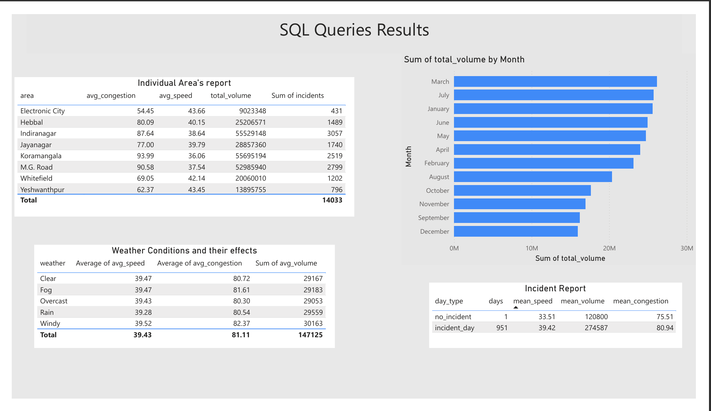
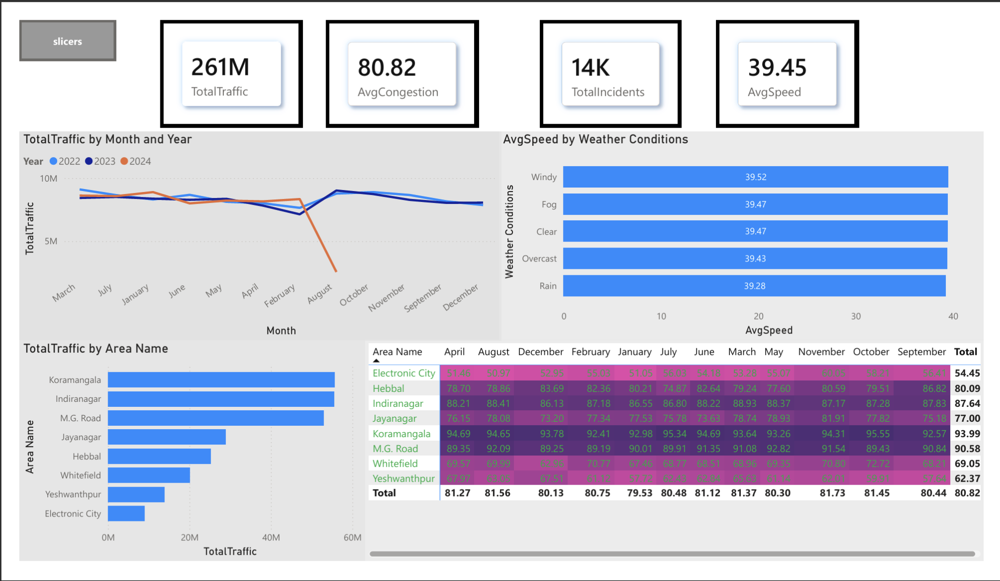

# 🚦 Bangalore Traffic Analysis — Excel | Python | SQL | Power BI

A complete end-to-end data analytics project exploring Bangalore’s traffic patterns using Excel, Python, SQL, and Power BI. The project uncovers congestion hotspots, monthly trends, weather effects, road-level issues, and incident-driven congestion changes, supported by interactive dashboards and SQL-driven insights.

## 📌 Dataset Source
**Dataset obtained from Kaggle:** 👉 [Bangalore City Traffic Dataset](https://www.kaggle.com/datasets/preethamgouda/banglore-city-traffic-dataset)

*Special thanks to the dataset creator!*

---

## 🎯 Objective
To analyze Bangalore’s traffic congestion using statistical, analytical, and visualization techniques applied across multiple tools. The goal is to discover:

* High-congestion roads & areas
* Monthly and seasonal trends
* Weather impact on average speeds
* Road-level congestion severity
* Incident-driven congestion difference
* Area × Month performance using heatmaps

This project demonstrates strong skills in **data cleaning, SQL analytics, visualization, dashboard design, and storytelling.**

---

## 🛠️ Tools & Technologies

| Tool | Purpose |
| :--- | :--- |
| **Excel** | Initial cleaning, pivot analysis |
| **Python** (Pandas, Matplotlib, Seaborn) | Data prep, EDA, transformation |
| **SQLite + SQL** | Analytical queries, ranking, aggregation |
| **Power BI** | Interactive report, KPIs, heatmaps |
| **Git/GitHub** | Version control & documentation |

---

## 🧹 1. Data Preparation
**Executed in Excel + Python**

### ✔ Feature Engineering
- [x] Month
- [x] Year
- [x] WeekNumber
- [x] Quarter
- [x] DayOfWeek

### ✔ Data Cleaning
- [x] Handled missing congestion/speed using median imputation per area.
- [x] Standardized weather & area names.
- [x] Removed inconsistencies in date formatting.

---

## 📊 2. Exploratory Data Analysis (Python)
Performed visual exploration to understand:
* Monthly traffic volume patterns
* Speed vs. Congestion relationships
* Area-level volume distribution
* Weather effect on traffic slowdown
* Incident vs non-incident day differences

📂 **Notebook available in:** `python/analysis_notebook.ipynb`

---

## 🧮 3. SQL Analysis
The SQL analysis digs deep into the data to generate specific reports.



### ⭐ Individual Area Summary
*Shows avg congestion, avg speed, total volume, and incidents for each area.*
* **Indiranagar** (87.64) and **Koramangala** (93.99) rank among the most congested areas.
* **Electronic City** shows much lower congestion (54.45).

### ⭐ Monthly Volume Summary
* **March, July, and January** have the highest traffic volumes.

### ⭐ Weather Impact
* **Fog & Windy** conditions show higher congestion averages (~81–82).
* **Clear days** have better flow.

### ⭐ Incident Analysis
* **Incident days:** Average 80.94 congestion.
* **Non-incident days:** Average 75.51 congestion (Significant difference).

### ⭐ Congestion Ranking
Ranks areas from most to least congested:
1.  Koramangala
2.  M.G. Road
3.  Indiranagar
4.  Hebbal
8.  Electronic City

### ⭐ Final Road Summary
*Includes road-level traffic volume, avg speed, and avg congestion.*
* **Sony World Junction:** 94.13 avg congestion
* **Sarjapur Road:** 93.85 avg congestion
* **100 Feet Road:** High traffic volume (27M+)

---

## 📈 4. Power BI Dashboard



### ⭐ Dashboard Highlights (`report.pdf`)
* **KPI Cards:** 261M Total Traffic | 80.82 Avg Congestion | 14K Incidents | 39.45 Avg Speed.
* **Traffic Trend:** Line chart shows monthly trends across 2022–2024, revealing dips (e.g., August) and peaks.
* **Area-wise Volume:** Bar chart highlights top congested areas: Koramangala, Indiranagar, MG Road.
* **Weather Impact:** Horizontal bar chart showing variations in speeds across weather types.
* **Area-Month Heatmap:** Matrix with conditional formatting showing congestion trends across all months.

### ⭐ SQL Results Integration
* Individual area tables.
* Monthly volume ranking.
* Incident vs. normal day comparisons.

---

## 🔎 Key Insights

> 1.  **Koramangala, Indiranagar, and MG Road** are the most congested zones.
> 2.  **August** shows a notable traffic drop, while **March and July** peak.
> 3.  **Weather influences flow:** Windy and Fog days show higher congestion.
> 4.  **Incidents matter:** Incident days record higher congestion by ~5.4 points compared to normal days.
> 5.  **Hotspots:** Sony World Junction, Sarjapur Road, and 100 Feet Road are the top road-level hotspots.

---

## 📥 How to Run This Project

**1. Clone the Repository**
```bash
git clone [https://github.com/shashank18-04/bangalore_Traffic_Analysis.git]
```
**2. Open the Notebook**
Run `analysis_notebook.ipynb` for EDA.

**3. Execute SQL Files**
Run SQL queries located in `/sql` on the SQLite database or Power BI SQL connector.

**4. Open the Dashboard**
Open `powerbi/dashboard.pbix` in Power BI Desktop.

---

## 🔮 Future Enhancements
- [ ] Predict future traffic using ML models (ARIMA / LSTM).
- [ ] Include geospatial maps (ArcGIS or MapBox in Power BI).
- [ ] Build real-time dashboard using streaming data.

---

## 🤝 Acknowledgements
Dataset sourced from **[Kaggle](https://www.kaggle.com/datasets/preethamgouda/banglore-city-traffic-dataset)**.
*Thanks to the dataset creator for making this project possible.*

---

## 🙌 Contact
If you'd like to connect or discuss the project:

* 📧 **Email:** [shashankngowda18@gmail.com]
* 👔 **LinkedIn:** [linkedin](https://www.linkedin.com/in/shashank-n-gowda-148456258/)


